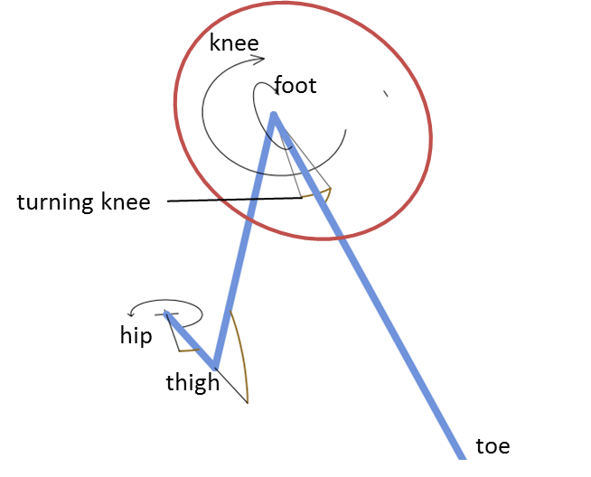

When seeing a video about a walking Hexapod no one screams wow, that’s unbelievable. There must be more. For one, you could cut off one leg. Having 5 legs only is kinda creepy, and it might be a challenge to develop a gait with one missing leg where you cannot steal something from nature. And, you can spend 1/6 of the money for something else.

But, still kinda boring. So, I tried to give it a personality, it should be something shy and chicken-hearted, but how to express that if you’re a slightly too big insect with one missing leg? Hiding from anything that’s moving could be something. And, something that I can do with the saved money of one leg: Buy a Lidar sensor and put it on its head to identify suspicious subjects, then escape and hide in holes. That's really pathetic.

Typical Hexapods have 3-5 DOF per leg, and most of them have only one DOF that moves the leg from the left to the right while all other DOFs move up and down. I never got the idea behind that design, since when looking at most of the hexapods you get the impression that the goal was to implement a brutal & stomping gait by always moving the full mass of a leg. In nature, no instect stomps. Those who make women scream have crawling movements where the foot carefully checks out the ground ahead and the femur hardly moves. This requires a turning hip or knee. There’s just one hexapod I am aware of (“Weaver”) that spends one DOF for turning a leg such that the foot can move forward and backward without moving the femur. Unfortunately, this DOF is not used during walking but only to compensate standing on a ramp and levelling the body’s orientation.

In the end, I decided to go with a turning knee. 

The blue lines illustrate the leg consisting of the joints for hip, thigh, knee and foot.
The turning knee (θ2) allows to move the toe to the left and the right without moving the tibia. This should allow more efficient movements since the tibia moves less compared to a classical design without a turning knee.

The effect can be seen here, this one is a version without a turning knee (not reepy).

This is the version with a turning knee (creepy).

To have the capability to walk in uneven terrain, there’s the need knowing the distance of a toe to the ground. Although it might be sufficient to know if the toe touches the ground,actually this surprises the gait controller all the time. Knowing the distance results in a smoother gait control that is able to accelerate and decallerate in advance. So, I decided to go with a cheap laser distance controller built in each leg.

